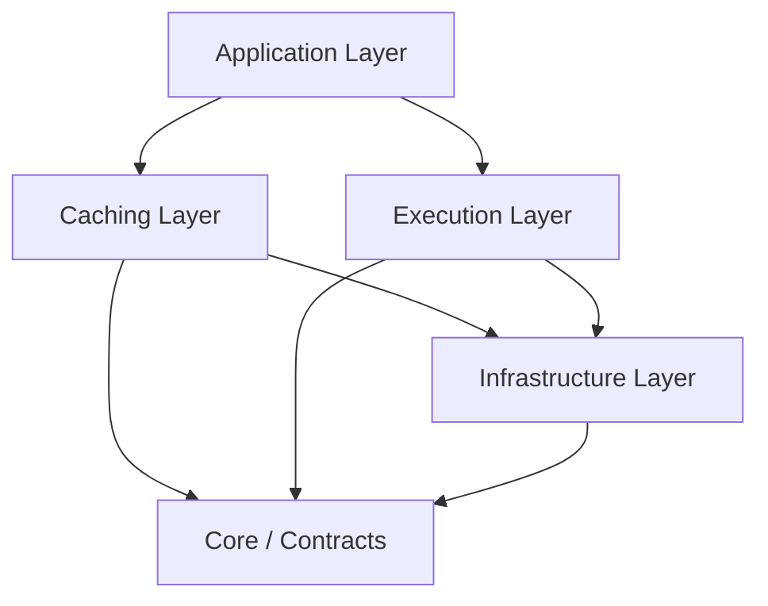

# 아키텍처 개요 (Architecture Overview)

<!-- AI_CONTEXT: START -->
<!-- ROLE: CONCEPTUAL_GUIDE -->
<!-- AI_CONTEXT: END -->

`Lib.Db`는 단순한 데이터베이스 래퍼가 아닌, **고성능 분산 시스템을 위한 데이터 액세스 플랫폼**입니다. 이 문서는 라이브러리의 설계 철학과 내부 아키텍처를 설명합니다.

---

## 1. 아키텍처 철학 (Philosophy)

### 1-1. 형태-의미 동형성 (Morphological-Semantic Isomorphism)
우리는 물리적 구조(폴더)와 논리적 구조(네임스페이스, 의존성)를 1:1로 일치시킵니다.
*   **물리적**: `Lib.Db/Core` 폴더
*   **논리적**: `Lib.Db.Core` 네임스페이스
*   **의존성**: `Core`는 `Execution`이나 `Caching`을 참조할 수 없습니다.

### 1-2. 핵심 보호 (Core Protection)
시스템의 심장부인 `Core`와 `Contracts` 레이어는 변경 빈도가 가장 낮아야 하며, 외부 의존성이 없어야 합니다. 모든 고수준 기능(Polly, Logging, Caching)은 이 코어 위에 쌓아 올려집니다.

---

## 2. 레이어 구조 (Layered Architecture)

### 🔹 Contracts Layer
*   **역할**: 순수 인터페이스 및 DTO 정의.
*   **특징**: `Lib.Db.TvpGen`(Source Generator)이 참조하는 유일한 런타임 라이브러리입니다.
*   **주요 컴포넌트**: `IDbExecutor`, `IProcedureStage`, `TvpRowAttribute`

### 🔹 Core Layer
*   **역할**: 저수준 프리미티브 및 유틸리티.
*   **특징**: `UnsafeAccessor`, `Span<T>` 처리 등 성능 최적화 코드 집약.

### 🔹 Infrastructure Layer
*   **역할**: 진단, 로깅, 파라미터 바인딩 로직.
*   **특징**: `DbRequestBuilder`의 바인딩 로직(`DbBinder`)이 이곳에 위치합니다.

### 🔹 Execution Layer
*   **역할**: 실제 SQL 실행 엔진 (`SqlDbExecutor`).
*   **특징**: `Microsoft.Data.SqlClient`에 대한 직접적인 종속성을 가지며, 실제 DB 연결을 관리합니다.

### 🔹 Caching Layer
*   **역할**: L1(Local) + L2(Shared Memory) 하이브리드 캐시.
*   **특징**: `SharedMemoryCache`를 통해 프로세스 간 데이터 동기화 제공.
*   **주요 컴포넌트**:
    *   `SharedMemoryCache`: Memory Mapped File 기반 L2 캐시
    *   `CacheLeaderElection`: 리더 선출 및 유지보수 조율
    *   `GlobalCacheEpoch`: Epoch 기반 캐시 무효화
    *   `CacheMaintenanceService`: 백그라운드 정리 작업

---

## 4. 주요 컴포넌트 목록

### Contracts Layer
- `IDbContext`: 라이브러리 메인 진입점
- `IProcedureStage`: 명령 정의 단계 인터페이스
- `IParameterStage`: 파라미터 설정 단계
- `IExecutionStage<TParams>`: 실행 단계
- `IDbExecutor`: 저수준 실행기 인터페이스
- `TvpRowAttribute`: TVP 정의용 어트리뷰트

### Core Layer
- `DbSession`: 세션 관리 프리미티브
- `InterpolatedStringHandler`: Zero-Allocation SQL 파라미터 처리
- `UnsafeAccessorHelper`: 고성능 리플렉션 대체

### Infrastructure Layer
- `DbBinder`: 파라미터 바인딩 로직
- `ConfigurableChaosInjector`: 카오스 엔지니어링 (문서에서는 간략히 `ChaosInjector`로 표기)
- `DiagnosticLogger`: 구조화된 로깅

### Execution Layer
- `SqlDbExecutor`: SQL Server 실행 엔진
- `DbConnectionFactory`: 3-Tier 커넥션 풀링
- `ResiliencePipelineProvider`: Polly v8 통합

### Caching Layer
- `SharedMemoryCache`: MMF 기반 L2 캐시
- `CacheLeaderElection`: 자동 리더 선출
- `GlobalCacheEpoch`: 버전 관리

### Source Generators
- `TvpAccessorGenerator` (`Lib.Db.TvpGen`): TVP 바인딩 코드 생성
- `ResultAccessorGenerator` (`Lib.Db.TvpGen`): `DbDataReader` 결과를 DTO로 매핑하는 코드 생성 (Track 5 알고리즘)

---

## 5. 데이터 흐름 (Data Flow)

1.  **요청 생성**: 사용자가 `db.Default.Sql(...)`로 Fluent Builder 시작.
2.  **컴파일(AOT)**: 소스 제너레이터가 SQL 파라미터 매핑 코드를 정적으로 생성.
3.  **바인딩**: `Core` 레이어의 `InterpolatedStringHandler`가 SQL 문자열과 인자를 `Zero-Allocation`으로 결합.
4.  **실행**: `Execution` 레이어가 커넥션을 풀링에서 가져와 명령 수행.
5.  **매핑**: `DbDataReader`의 결과를 `Contracts`에 정의된 타겟 DTO로 고속 매핑.

---

이 구조는 **Native AOT** 환경에서 런타임 오류를 원천 차단하고, 컴파일 타임에 모든 타입 안전성을 보장하기 위해 설계되었습니다.

---

  <a href="./02_configuration_and_di.md">다음: 설치 및 구성➡️</a>

  🏠 <a href="../README.md">홈으로</a>

