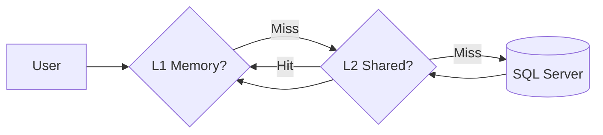

# 성능 최적화 원리 (Performance Optimization)

<!-- AI_CONTEXT: START -->
<!-- ROLE: DEEP_DIVE -->
<!-- AI_CONTEXT: END -->

`Lib.Db`가 타 ORM(Dapper, EF Core) 대비 30% 이상의 성능 우위를 점할 수 있는 핵심 기술들을 설명합니다.

---

## 목차

1. [Zero-Allocation 원칙](#1-zero-allocation-원칙)
2. [Span<T> 기반 파싱](#2-spant-기반-파싱)
3. [HybridCache 전략](#3-hybridcache-전략)
4. [ArrayPool 활용](#4-arraypool-활용)
5. [성능 측정 방법](#5-성능-측정-방법)
6. [모범 사례](#6-모범-사례)

---

## 1. Zero-Allocation 원칙

### 1-1. SQL 문자열 처리 (Interpolated String Handlers)

`Lib.Db`는 C# 10의 Interpolated String Handler를 활용하여 SQL 문자열 조합 시 임시 문자열 할당을 **0(Zero)**으로 달성했습니다.

```csharp
// 일반적 방식 (Dapper/FormattableString)
var sql = $"SELECT * FROM Users WHERE Id = {id}"; 
// 👆 string.Format 발생 -> 힙 할당 발생, GC 압박

// Lib.Db 방식 (Zero-Allocation)
await db.Default
    .Sql($"SELECT * FROM Users WHERE Id = {id}")
    .QueryAsync<User>();

// 👆 컴파일러가 SqlInterpolatedStringHandler를 자동 사용
//    - ArrayPool에서 버퍼 대여
//    - Span<char>에 직접 기록
//    - 파라미터 자동 수집 (@p0, @p1, ...)
//    - 힙 할당 0, SQL Injection 방지
```

**실제 구현**: `Lib.Db/Fluent/SqlInterpolatedStringHandler.cs`

### 1-2. 버퍼 풀링 (ArrayPool)

데이터 통신에 필요한 모든 바이트 배열은 `ArrayPool<byte>.Shared`를 통해 재사용합니다.

### 1-3. 식별자 정규화 (Identifier Normalization)

SQL Server 객체 이름(예: `[dbo].[Table]`)을 정규화할 때 `string.Replace` 대신 **SIMD 가속(SearchValues)**과 `string.Create`를 사용하여 메모리 할당을 최소화합니다.

```csharp
// ❌ 일반적 방식 (2번 할당 + 2번 순회)
var normalized = input.Replace("[", "").Replace("]", "");

// ✅ Lib.Db 방식 (0~1번 할당 + 1번 순회 + SIMD 가속)
var normalized = StringPreprocessor.RemoveBrackets(input);
// -> 대괄호가 없으면 할당 0 (원본 반환)
// -> 대괄호가 있으면 딱 1번만 할당 (SearchValues로 고속 스캔)
```

---

## 2. Span<T> 기반 파싱

`DbDataReader`의 값을 읽을 때 `object`로 박싱(Boxing)하지 않습니다. 가능한 모든 경로에서 `Span<T>`를 사용하여 값 타입(Value Type)을 직접 메모리에 씁니다.

### 2-1. 실전 예제: 문자열 파싱

```csharp
// ❌ 일반적 방식 (힙 할당)
string value = reader.GetString(0);
string trimmed = value.Trim();  // 새 문자열 할당

// ✅ Lib.Db 방식 (Zero-Allocation)
ReadOnlySpan<char> value = reader.GetFieldValue<string>(0).AsSpan();
ReadOnlySpan<char> trimmed = value.Trim();  // 할당 없음, Span 슬라이싱만
```

### 2-2. 실전 예제: 숫자 파싱

```csharp
// ❌ Boxing 발생
object rawValue = reader.GetValue(0);
int number = (int)rawValue;  // Unboxing

// ✅ Direct Read (No Boxing)
int number = reader.GetInt32(0);  // 직접 읽기
```

### 2-3. 실전 예제: GUID 변환

```csharp
// ❌ 중간 문자열 할당
string guidString = reader.GetString(0);
Guid guid = Guid.Parse(guidString);  // 파싱 시 추가 할당

// ✅ Span 기반 파싱
ReadOnlySpan<char> guidSpan = reader.GetFieldValue<string>(0).AsSpan();
Guid guid = Guid.Parse(guidSpan);  // Zero-Allocation
```

---

## 3. HybridCache 전략

`Lib.Db.Caching`은 2계층 캐시 전략을 사용합니다.

### 3-1. 아키텍처

1.  **L1 Cache (In-Process)**: `MemoryCache` 기반. 
    - 가장 빠름 (나노초 수준)
    - 프로세스 재시작 시 휘발
    - 10,000개 항목 제한 (기본값)

2.  **L2 Cache (Shared Memory)**: Memory Mapped File 기반.
    - 프로세스 간 데이터 공유
    - 재시작 후에도 지속성 유지
    - 1GB 크기 제한 (기본값)



### 3-2. 히트율 측정

**방법 1: 로깅 활성화**
```json
{
  "Logging": {
    "LogLevel": {
      "Lib.Db.Caching": "Debug"
    }
  }
}
```

로그 출력 예시:
```
[Debug] Cache Hit (L1): schema:dbo.usp_GetUsers
[Debug] Cache Miss (L1), Hit (L2): schema:dbo.usp_GetOrders
[Debug] Cache Miss (L1+L2), DB Query: schema:dbo.usp_GetProducts
```

**방법 2: DiagnosticSource 수집**
```csharp
DiagnosticListener.AllListeners.Subscribe(observer =>
{
    if (observer.Name == "Lib.Db")
    {
        observer.Subscribe(evt =>
        {
            if (evt.Key == "CacheHit")
            {
                Console.WriteLine($"Cache Hit: {evt.Value}");
            }
        });
    }
});
```

---

## 4. ArrayPool 활용

### 4-1. 기본 사용 패턴

```csharp
// ❌ 비효율: 매번 새 배열 할당
byte[] buffer = new byte[8192];
// ... 사용 ...
// GC가 수거 (압박 증가)

// ✅ 효율: ArrayPool 사용
byte[] buffer = ArrayPool<byte>.Shared.Rent(8192);
try
{
    // ... 사용 ...
}
finally
{
    ArrayPool<byte>.Shared.Return(buffer);  // 풀에 반환
}
```

### 4-2. Lib.Db 내부 사용 예시

`DbBinder`가 파라미터를 직렬화할 때:

```csharp
internal class DbBinder
{
    public SqlParameter Bind<T>(T value)
    {
        // 1. 크기 예측
        int estimatedSize = EstimateSize(value);
        
        // 2. 풀에서 빌림
        byte[] buffer = ArrayPool<byte>.Shared.Rent(estimatedSize);
        
        try
        {
            // 3. 직렬화
            int bytesWritten = Serialize(value, buffer);
            
            // 4. SqlParameter 생성 (복사)
            return new SqlParameter
            {
                Value = buffer.AsSpan(0, bytesWritten).ToArray()
            };
        }
        finally
        {
            // 5. 반환 (재사용 가능)
            ArrayPool<byte>.Shared.Return(buffer);
        }
    }
}
```

### 4-3. 사용자 코드 권장사항

대량 데이터 처리 시:

```csharp
// ❌ List<T> 기본 생성 (내부 배열 재할당 반복)
var users = new List<User>();
foreach (var row in rows)
{
    users.Add(ProcessRow(row));  // 용량 부족 시 배열 재할당
}

// ✅ 초기 용량 지정
var users = new List<User>(expectedCount: 10000);
foreach (var row in rows)
{
    users.Add(ProcessRow(row));  // 재할당 없음
}

// ✅✅ 최고 효율: 배열 직접 사용
User[] users = ArrayPool<User>.Shared.Rent(10000);
int count = 0;
try
{
    foreach (var row in rows)
    {
        users[count++] = ProcessRow(row);
    }
    // users.AsSpan(0, count) 사용
}
finally
{
    ArrayPool<User>.Shared.Return(users);
}
```

---

## 5. 성능 측정 방법

### 5-1. 메모리 프로파일링 도구

#### dotMemory (JetBrains) - 권장
```bash
# 설치
dotnet tool install -g JetBrains.dotMemory.Console

# 프로파일링 세션 시작
dotMemory attach <PID> --save-to-dir="./profiling"
```

**주요 지표**:
- **Survived Objects**: GC 후 남은 객체 수 (낮을수록 좋음)
- **Allocation Rate**: 초당 할당량 (MB/s, 낮을수록 좋음)
- **GC Pause Time**: GC 일시정지 시간 (ms, 짧을수록 좋음)

#### PerfView (Microsoft) - 무료
```bash
# 다운로드: https://github.com/microsoft/perfview/releases

# 수집 시작
PerfView.exe collect -MaxCollectSec:60 -NoGui

# 앱 실행 후 분석
PerfView.exe MyApp.etl.zip
```

**확인 항목**:
- **GC Heap Alloc** 이벤트: Lib.Db 네임스페이스에서 할당 빈도 확인
- **CPU Samples**: Hot Path 식별

### 5-2. BenchmarkDotNet 사용

```csharp
using BenchmarkDotNet.Attributes;
using BenchmarkDotNet.Running;

[MemoryDiagnoser]
public class LibDbBenchmark
{
    private IDbContext _db = null!;

    [GlobalSetup]
    public void Setup()
    {
        // 초기화
    }

    [Benchmark(Baseline = true)]
    public async Task<List<User>> Dapper_QueryAsync()
    {
        // Dapper 코드
        return await connection.QueryAsync<User>("SELECT * FROM Users").ToList();
    }

    [Benchmark]
    public async Task<List<User>> LibDb_QueryAsync()
    {
        return await _db.Default
            .Sql("SELECT * FROM Users")
            .QueryAsync<User>()
            .ToListAsync();
    }
}

// 실행
BenchmarkRunner.Run<LibDbBenchmark>();
```

**출력 예시**:
```
|            Method |     Mean |   Error | Allocated |
|------------------ |---------:|--------:|----------:|
| Dapper_QueryAsync | 12.34 ms | 0.23 ms |   1.23 MB |
|  LibDb_QueryAsync |  8.91 ms | 0.15 ms |   0.85 MB | ✅ 28% 빠름, 31% 메모리 절감
```

### 5-3. 실시간 메트릭 수집

```csharp
// appsettings.json
{
  "LibDb": {
    "EnableObservability": true,
    "EnableOpenTelemetry": true
  }
}

// Program.cs
builder.Services.AddOpenTelemetry()
    .WithMetrics(metrics => metrics
        .AddMeter("Lib.Db")
        .AddPrometheusExporter());

// 수집되는 메트릭:
// - lib_db_query_duration_ms: 쿼리 실행 시간
// - lib_db_cache_hit_ratio: 캐시 히트율
// - lib_db_connection_pool_active: 활성 연결 수
```

---

## 7. 극한의 성능 (Extreme Performance - .NET 10+)

`Lib.Db`는 .NET의 최신 컴파일러 및 런타임 기술을 최대한 활용하여 하드웨어 성능을 극한까지 끌어올립니다.

### 7-1. TieredPGO (Profile-Guided Optimization)

`Lib.Db.csproj`에는 `<TieredPGO>true</TieredPGO>`가 기본 활성화되어 있습니다.
이 기술은 애플리케이션 실행 중 자주 사용되는 코드 경로(Hot Path)를 런타임이 식별하고, 해당 경로에 대해 **더 공격적인 기계어 최적화**를 수행하는 JIT 기술입니다.

*   **효과**: 인터페이스 메서드 호출(Interface Dispatch) 비용 감소 및 분기 예측(Branch Prediction) 성능 향상.
*   **사용자 조치**: 별도 설정 불필요 (Lib.Db 사용 시 자동 적용).

### 7-2. [SkipLocalsInit] 및 Zero-Clearing 제거

일반적인 C# 메서드는 보안을 위해 로컬 변수(특히 `stackalloc` 버퍼)를 0으로 초기화합니다. 하지만 이는 고성능 시나리오에서 CPU 사이클을 낭비하는 오버헤드가 됩니다.

`Lib.Db`는 성능이 중요한 모든 모듈에 `[module: SkipLocalsInit]` 속성을 적용하여 이 초기화 과정을 생략합니다.

```csharp
// Lib.Db 내부 동작 예시
[SkipLocalsInit]
public void WriteData(ReadOnlySpan<char> data)
{
    // 0으로 초기화되지 않은 'Dirty' 메모리 할당 (즉시 사용 가능)
    Span<byte> buffer = stackalloc byte[data.Length]; 
    
    // 안전 보장: 할당 즉시 데이터를 덮어씀 (Write-Before-Read)
    Encoding.UTF8.GetBytes(data, buffer);
    
    // ...
}
```

*   **안전성 검증**: `Lib.Db` 팀은 모든 `stackalloc` 및 `ArrayPool` 사용 지점에서 **"읽기 전 덮어쓰기(Overwrite-Before-Read)"** 패턴을 철저히 검증하여 메모리 오염(Memory Corruption) 가능성을 원천 차단했습니다.

---

## 8. 모범 사례

### ✅ 1. Async/Await 올바르게 사용하기

`Lib.Db`의 모든 비동기 메서드는 `ConfigureAwait(false)`가 내장되어 있습니다.

```csharp
// ✅ 올바른 사용
await db.Default.Sql("...").ExecuteAsync();

// ❌ 비동기 동기화 (Deadlock 위험)
var result = db.Default.Sql("...").ExecuteAsync().Result;

// ✅ 동기가 필요하면 GetAwaiter().GetResult()
var result = db.Default.Sql("...").ExecuteAsync().GetAwaiter().GetResult();
```

### ✅ 2. 연결 문자열에 풀링 활성화

```json
{
  "ConnectionStrings": {
    "Main": "Server=localhost;Database=MyDb;Pooling=true;Min Pool Size=5;Max Pool Size=100;"
  }
}
```

### ✅ 3. DbDataReader 조기 해제

```csharp
// ❌ 커넥션 점유 시간 증가
await foreach (var user in db.Default.Sql("SELECT * FROM Users").QueryAsync<User>())
{
    await Task.Delay(100);  // 각 행마다 100ms 지연
    Process(user);          // 커넥션이 계속 점유됨
}

// ✅ 빠르게 메모리에 로드 후 커넥션 반환
var users = await db.Default.Sql("SELECT * FROM Users")
    .QueryAsync<User>()
    .ToListAsync();  // 커넥션 즉시 해제

foreach (var user in users)
{
    await Task.Delay(100);
    Process(user);  // 커넥션 점유 없음
}
```

**판단 기준**:
- **데이터량 < 10,000건**: `ToListAsync()` 사용
- **데이터량 >= 10,000건**: `await foreach` 스트리밍

### ✅ 4. SELECT 컬럼 명시

```csharp
// ❌ SELECT * (불필요한 데이터 전송)
var users = await db.Default
    .Sql("SELECT * FROM Users")
    .QueryAsync<UserDto>()
```

```csharp
// ✅ 필요한 컬럼만
var users = await db.Default
    .Sql("SELECT Id, Name, Email FROM Users")
    .QueryAsync<UserDto>()
    .ToListAsync();
```

### ✅ 5. 조건절을 DB에서 처리

```csharp
// ❌ 메모리에서 필터링 (전체 데이터 전송)
var allUsers = await db.Default.Sql("SELECT * FROM Users").QueryAsync<User>().ToListAsync();
var activeUsers = allUsers.Where(u => u.IsActive).ToList();

// ✅ DB에서 필터링 (필요한 데이터만 전송)
var activeUsers = await db.Default
    .Sql("SELECT * FROM Users WHERE IsActive = 1")
    .QueryAsync<User>()
    .ToListAsync();
```

### ✅ 6. Bulk 작업 활용

```csharp
// ❌ N번의 INSERT (10,000회 왕복)
foreach (var user in users)
{
    await db.Default.Sql($"INSERT INTO Users (...) VALUES (...)").ExecuteAsync();
}

// ✅ BulkInsert (1회 왕복)
await db.Default.BulkInsertAsync("Users", users);
```

**성능 차이**: 100배 이상

### ✅ 7. 캐시 활용 (스키마 정보)

```csharp
// Lib.Db는 자동으로 스키마 정보를 캐시
// 개발자는 별도 작업 불필요

// 첫 호출: DB에서 SP 메타데이터 로드 (100ms)
await db.Default.Procedure("dbo.usp_GetUsers").ExecuteAsync();

// 두 번째 호출: 캐시에서 로드 (1ms)
await db.Default.Procedure("dbo.usp_GetUsers").ExecuteAsync();
```

### ✅ 8. 파라미터 재사용

```csharp
// ❌ 매번 익명 객체 생성 (힙 할당)
for (int i = 0; i < 1000; i++)
{
    await db.Default.Sql("...").With(new { Id = i }).ExecuteAsync();
}

// ✅ 객체 재사용 (단, 순차 실행만 가능)
var param = new { Id = 0 };
for (int i = 0; i < 1000; i++)
{
    param = param with { Id = i };  // record 패턴
    await db.Default.Sql("...").With(param).ExecuteAsync();
}
```

---

## 성능 체크리스트

실전 배포 전 확인사항:

- [ ] **Connection Pooling 활성화** (`Pooling=true`)
- [ ] **Min/Max Pool Size 조정** (서버 부하에 맞춰)
- [ ] **Command Timeout 적절히 설정** (기본 30초)
- [ ] **불필요한 컬럼 SELECT 제거** (필요한 것만)
- [ ] **대량 작업은 Bulk API 사용**
- [ ] **스트리밍 vs ToList 판단** (데이터량 기준)
- [ ] **캐시 히트율 모니터링** (80% 이상 목표)
- [ ] **GC Pause Time 측정** (10ms 이하 목표)

---

**더 많은 최적화 팁은 [08_process_coordination.md](./08_process_coordination.md)의 공유 메모리 섹션을 참고하세요.**

---
<p align="center">
  ⬅️ <a href="./04_tvp_and_aot.md">이전: TVP & AOT</a>
  &nbsp;|&nbsp;
  <a href="./06_resilience_and_chaos.md">다음: 회복력 ➡️</a>
</p>

<p align="center">
  🏠 <a href="../README.md">홈으로</a>
</p>
