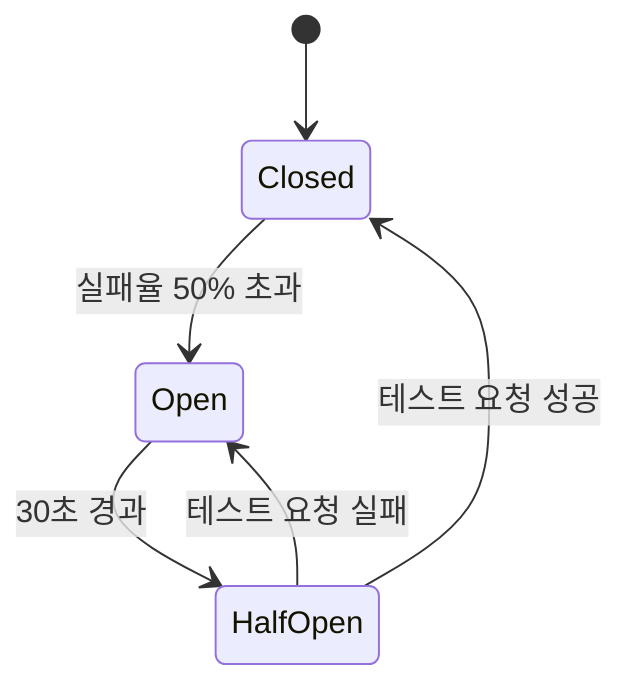

# 회복력 및 카오스 엔지니어링 (Resilience & Chaos)

<!-- AI_CONTEXT: START -->
<!-- ROLE: DEEP_DIVE -->
<!-- AI_CONTEXT: END -->

`Lib.Db`는 `Microsoft.Extensions.Resilience` (Polly v8) 라이브러리를 내장하여, 일시적인 데이터베이스 오류로부터 시스템을 보호합니다. 또한, 개발 단계에서 이러한 오류 상황을 시뮬레이션할 수 있는 **카오스 엔지니어링(Chaos Engineering)** 기능을 제공합니다.

---

## 목차

1. [Polly v8 기본 개념](#1-polly-v8-기본-개념)
2. [기본 회복력 정책](#2-기본-회복력-정책)
3. [Transient Error 목록](#3-transient-error-목록)
4. [Circuit Breaker 상세](#4-circuit-breaker-상세)
5. [카오스 엔지니어링](#5-카오스-엔지니어링)
6. [모니터링 및 관측](#6-모니터링-및-관측)
7. [커스터마이징](#7-커스터마이징)

---

## 1. Polly v8 기본 개념

### 1-1. Resilience Pipeline이란?

Polly v8에서는 여러 정책을 **파이프라인**으로 조합합니다.

```
User Request → [Retry] → [Circuit Breaker] → [Timeout] → Database
                ↓ 실패 시 재시도
                ↓ 계속 실패 시 차단
                ↓ 일정 시간 초과 시 취소
```

### 1-2. Lib.Db의 내장 Pipeline

`Lib.Db`는 다음 순서로 정책을 적용합니다:

1. **Timeout** (타임아웃)
2. **Retry** (재시도)
3. **Circuit Breaker** (서킷 브레이커)

```csharp
// 내부 구현 (간략화)
var pipeline = new ResiliencePipelineBuilder()
    .AddTimeout(TimeSpan.FromSeconds(30))
    .AddRetry(new RetryStrategyOptions
    {
        MaxRetryAttempts = 3,
        Delay = TimeSpan.FromMilliseconds(100),
        BackoffType = DelayBackoffType.Exponential
    })
    .AddCircuitBreaker(new CircuitBreakerStrategyOptions
    {
        FailureRatio = 0.5,
        SamplingDuration = TimeSpan.FromSeconds(30),
        MinimumThroughput = 5,
        BreakDuration = TimeSpan.FromSeconds(30)
    })
    .Build();
```

---

## 2. 기본 회복력 정책

별도의 설정 없이도 다음 정책이 **기본 적용**됩니다.

### 2-1. 재시도 (Retry)

*   **조건**: Transient Error 감지 시.
*   **전략**: 지수 백오프 (Exponential Backoff).
    - 1차 재시도: 100ms 대기
    - 2차 재시도: 200ms 대기
    - 3차 재시도: 400ms 대기
*   **횟수**: 기본 3회.
*   **Jitter**: 기본 활성화 (Thunder Herd 문제 방지)

```csharp
// appsettings.json
{
  "LibDb": {
    "Resilience": {
      "MaxRetryCount": 3,
      "BaseRetryDelayMs": 100,
      "MaxRetryDelayMs": 2000,
      "UseRetryJitter": true,
      "RetryBackoffType": "Exponential"
    }
  }
}
```

### 2-2. 서킷 브레이커 (Circuit Breaker)

*   **조건**: 일정 시간 내 오류 비율이 임계값을 초과할 경우.
*   **동작**: 추가 요청을 DB로 보내지 않고 즉시 예외(Fail-Fast)를 발생시켜 DB 부하를 줄임.
*   **복구**: 일정 시간(Break Duration) 후 단일 요청을 보내 확인(Half-Open)하고 안정이 확인되면 정상화(Closed).

```csharp
// appsettings.json
{
  "LibDb": {
    "Resilience": {
      "CircuitBreakerThreshold": 5,
      "CircuitBreakerSamplingDurationMs": 30000,
      "CircuitBreakerBreakDurationMs": 30000,
      "CircuitBreakerFailureRatio": 0.5
    }
  }
}
```

### 2-3. Timeout (타임아웃)

*   **조건**: 쿼리 실행 시간이 설정값 초과.
*   **동작**: `OperationCanceledException` 발생.
*   **기본값**: 30초 (일반), 600초 (Bulk 작업)

---

## 3. Transient Error 목록

`Lib.Db`는 다음 SQL Server 오류를 **일시적 오류(Transient Error)**로 간주하여 자동 재시도합니다.

| 오류 번호 | 이름 | 설명 | 재시도 가능 |
|:---:|:---|:---|:---:|
| **-2** | SqlException (Timeout) | 쿼리 타임아웃 | ✅ |
| **1205** | Deadlock Victim | 교착 상태 감지 | ✅ |
| **233** | Connection Initialization Error | 연결 초기화 실패 | ✅ |
| **64** | Connection Failed | 서버 연결 실패 | ✅ |
| **20** | Instance Not Available | SQL Server 인스턴스 미 응답 | ✅ |
| **40197** | Service Error (Azure SQL) | 서비스 오류 | ✅ |
| **40501** | Service Busy (Azure SQL) | 서비스 사용 중 | ✅ |
| **40613** | Database Unavailable (Azure SQL) | 데이터베이스 일시 중단 | ✅ |
| **49918** | Cannot Process Request | 요청 처리 불가 | ✅ |
| **49919** | Too Many Create/Update Operations | 과도한 작업 | ✅ |
| **49920** | Cannot Process (Insufficient Resources) | 리소스 부족 | ✅ |
| **4060** | Cannot Open Database | 데이터베이스 열기 실패 | ⚠️ |
| **18456** | Login Failed | 로그인 실패 | ❌ |
| **208** | Invalid Object Name | 테이블/뷰 없음 | ❌ |

**재시도 불가 오류**는 즉시 예외를 사용자에게 전파합니다.

---

## 4. Circuit Breaker 상세

### 4-1. 상태 전이 다이어그램



### 4-2. 상태별 동작

#### Closed (정상)
- 모든 요청 통과
- 실패율 추적 (30초 샘플링)
- 최소 5개 요청 후 평가 시작

#### Open (차단)
- **모든 요청 즉시 차단**
- `BrokenCircuitException` 발생
- 30초간 유지

#### Half-Open (테스트)
- 단일 요청만 허용 (테스트 목적)
- 성공 시 → Closed
- 실패 시 → Open

### 4-3. 실전 시나리오

```
T0: Closed 상태 (정상)
T1: 10개 요청 중 6개 실패 (60% 실패율)
T2: Open 상태 전환 (Circuit Breaker 작동)
T3~T32: 모든 요청 차단 (30초)
T33: Half-Open 상태 (테스트 요청 1개 허용)
T34: 테스트 성공 → Closed 복귀
```

---

## 5. 카오스 엔지니어링

개발 환경(Staging/Dev)에서 DB가 불안정한 상황을 테스트하고 싶다면 `appsettings.json`을 수정하세요.

### 5-1. 설정

```json
{
  "LibDb": {
    "Chaos": {
      "Enabled": true,          // ⚠️ 절대 프로덕션에서는 false!
      "ExceptionRate": 0.1,     // 10% 확률로 예외 발생
      "LatencyRate": 0.2,       // 20% 확률로 지연
      "MinLatencyMs": 500,
      "MaxLatencyMs": 2000      // 0.5~2초 랜덤 지연
    }
  }
}
```

### 5-2. 시뮬레이션 시나리오

#### 시나리오 1: 랜덤 예외

```csharp
// Chaos.Enabled = true, ExceptionRate = 0.1

// 10회 중 약 1회는 예외 발생
for (int i = 0; i < 10; i++)
{
    try
    {
        await db.Default.Sql("SELECT * FROM Users").QueryAsync<User>();
        Console.WriteLine($"Success #{i}");
    }
    catch (SqlException ex)
    {
        // Chaos Injector가 Deadlock 오류 시뮬레이션
        Console.WriteLine($"Failed #{i}: {ex.Message}");
    }
}

// 출력 예시:
// Success #0
// Success #1
// Failed #2: Transaction was deadlocked
// Success #3
// ...
```

#### 시나리오 2: 네트워크 지연

```csharp
// Chaos.Enabled = true, LatencyRate = 0.2

var sw = Stopwatch.StartNew();
await db.Default.Sql("SELECT COUNT(*) FROM Users").ExecuteScalarAsync<int>();
sw.Stop();

// 20% 확률로 500~2000ms 추가 지연
Console.WriteLine($"Elapsed: {sw.ElapsedMilliseconds}ms");

// 출력 예시:
// 80% 케이스: 50ms (정상)
// 20% 케이스: 1250ms (지연 주입)
```

### 5-3. 검증 목적

- **Retry 로직 테스트**: 재시도가 정상 작동하는가?
- **Circuit Breaker 테스트**: 오류율 50% 초과 시 차단되는가?
- **UI 로딩 상태**: 지연 시 UI가 멈추지 않는가?
- **Timeout 처리**: 타임아웃이 올바르게 처리되는가?

---

## 6. 모니터링 및 관측

### 6-1. 로깅

```csharp
// appsettings.json
{
  "Logging": {
    "LogLevel": {
      "Lib.Db.Infrastructure.Resilience": "Information"
    }
  }
}
```

**로그 출력 예시**:
```
[Information] Retry attempt 1/3 after Deadlock (1205)
[Warning] Retry attempt 2/3 after Connection Timeout (-2)
[Information] Retry succeeded on attempt 3
[Warning] Circuit Breaker opened (Failure Ratio: 60%)
[Information] Circuit Breaker half-open (Testing connection)
[Information] Circuit Breaker closed (Connection restored)
```

### 6-2. OpenTelemetry 메트릭

```csharp
// Program.cs
builder.Services.AddOpenTelemetry()
    .WithMetrics(metrics => metrics
        .AddMeter("Lib.Db")
        .AddPrometheusExporter());
```

**수집되는 메트릭**:
- `lib_db_retry_count`: 재시도 횟수
- `lib_db_circuit_breaker_state`: CB 상태 (0=Closed, 1=Open, 2=HalfOpen)
- `lib_db_transient_error_rate`: Transient Error 발생률

### 6-3. DiagnosticSource 이벤트

```csharp
DiagnosticListener.AllListeners.Subscribe(observer =>
{
    if (observer.Name == "Lib.Db.Resilience")
    {
        observer.Subscribe(evt =>
        {
            if (evt.Key == "RetryAttempt")
            {
                var attempt = (int)evt.Value.GetProperty("Attempt");
                var exception = (Exception)evt.Value.GetProperty("Exception");
                Console.WriteLine($"Retry {attempt}: {exception.Message}");
            }
        });
    }
});
```

### 6-4. Health Check

```csharp
// Program.cs
builder.Services.AddHealthChecks()
    .AddCheck<LibDbHealthCheck>("libdb");

app.MapHealthChecks("/health");
```

**응답 예시**:
```json
{
  "status": "Healthy",
  "results": {
    "libdb": {
      "status": "Healthy",
      "data": {
        "circuitBreakerState": "Closed",
        "retryCount": 0,
        "lastError": null
      }
    }
  }
}
```

---

## 7. 커스터마이징

### 7-1. 커스터마이징 가능 여부

> [!IMPORTANT]
> **현재 버전(v1.1)에서는 Resilience Pipeline의 직접 커스터마이징이 제한적입니다.**

`Lib.Db`는 내부적으로 최적화된 Pipeline을 사용하며, `appsettings.json`을 통해 **파라미터 조정만 가능**합니다.

### 7-2. 조정 가능한 파라미터

| 파라미터 | 기본값 | 범위 | 설명 |
|:---|:---:|:---:|:---|
| `MaxRetryCount` | 3 | 0~10 | 최대 재시도 횟수 |
| `BaseRetryDelayMs` | 100 | 10~5000 | 재시도 기본 지연 |
| `MaxRetryDelayMs` | 2000 | 100~30000 | 재시도 최대 지연 |
| `UseRetryJitter` | true | true/false | Jitter 사용 |
| `CircuitBreakerFailureRatio` | 0.5 | 0.1~1.0 | 실패율 임계값 |
| `CircuitBreakerBreakDurationMs` | 30000 | 1000~300000 | 차단 유지 시간 |

### 7-3. 고급 커스터마이징 (향후 지원 예정)

```csharp
// ⚠️ 미구현 - 향후 v2.1에서 제공 예정

public interface ILibDbResilienceConfigurer
{
    void Configure(ResiliencePipelineBuilder builder);
}

// 사용자 정의 정책
public class MyCustomResiliencePolicy : ILibDbResilienceConfigurer
{
    public void Configure(ResiliencePipelineBuilder builder)
    {
        builder.AddRetry(new RetryStrategyOptions
        {
            MaxRetryAttempts = 5,  // 커스텀 값
            ShouldHandle = new PredicateBuilder().Handle<CustomException>()
        });
    }
}

// DI 등록
services.AddHighPerformanceDb(cfg =>
{
    cfg.ResilienceConfigurer = new MyCustomResiliencePolicy();
});
```

### 7-4. 현재 우회 방법

Resilience를 완전히 비활성화하고 직접 구현:

```csharp
// appsettings.json
{
  "LibDb": {
    "EnableResilience": false  // Polly 비활성화
  }
}

// 사용자 코드에서 Polly 직접 사용
var pipeline = new ResiliencePipelineBuilder()
    .AddRetry(/* 커스텀 정책 */)
    .Build();

await pipeline.ExecuteAsync(async ct =>
{
    return await db.Default.Sql("...").ExecuteAsync(ct);
});
```

---

## 권장 설정

### 개발/테스트 환경
```json
{
  "LibDb": {
    "Resilience": {
      "MaxRetryCount": 2,
      "BaseRetryDelayMs": 50
    },
    "Chaos": {
      "Enabled": true,
      "ExceptionRate": 0.05
    }
  }
}
```

### 프로덕션 환경
```json
{
  "LibDb": {
    "EnableResilience": true,
    "Resilience": {
      "MaxRetryCount": 3,
      "CircuitBreakerFailureRatio": 0.3
    },
    "Chaos": {
      "Enabled": false  // 🚨 필수!
    }
  }
}
```

### 고가용성 (HA) 환경
```json
{
  "LibDb": {
    "Resilience": {
      "MaxRetryCount": 5,
      "CircuitBreakerThreshold": 10,
      "CircuitBreakerFailureRatio": 0.2,
      "CircuitBreakerBreakDurationMs": 10000
    }
  }
}
```

---

**Resilience와 Chaos Engineering을 통해 안정적인 프로덕션 서비스를 구축하세요!**

---

<p align="center">
  ⬅️ <a href="./05_performance_optimization.md">이전: 성능 최적화</a>
  &nbsp;|&nbsp;
  <a href="./07_troubleshooting.md">다음: 트러블슈팅 ➡️</a>
</p>

<p align="center">
  🏠 <a href="../README.md">홈으로</a>
</p>
