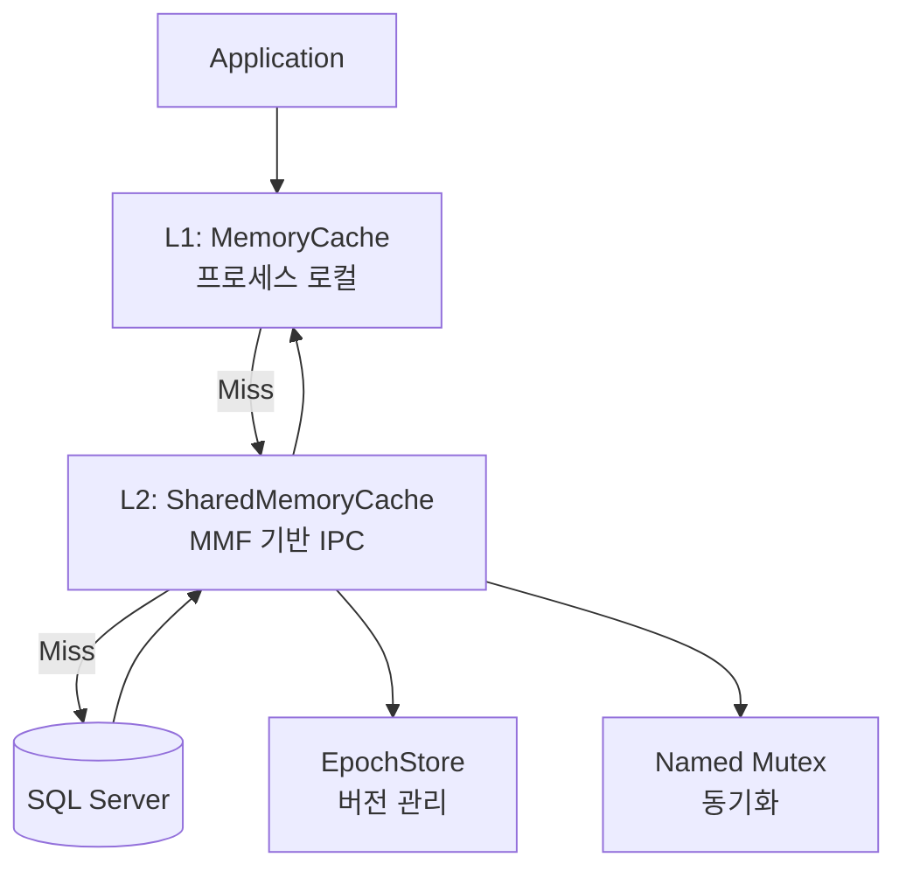

# 🧠 프로세스 코디네이션 및 공유 메모리 아키텍처 (Process Coordination)

<!-- AI_CONTEXT: START -->
<!-- ROLE: TECHNICAL_SPECIFICATION -->
<!-- TARGET: Lib.Db/Caching/CacheCoordination.cs, Lib.Db/Caching/SharedMemoryCache.cs, Lib.Db/Caching/CachingInfrastructure.cs -->
<!-- AI_CONTEXT: END -->

`Lib.Db`는 단일 머신 내에서 실행되는 여러 프로세스(IIS Worker Process, Console Apps, Docker Containers 등) 간의 효율적인 **데이터 공유**와 **자동 동기화**를 위해 **고성능 공유 메모리 아키텍처**를 내장하고 있습니다.

이 문서는 **개발자의 설정 없이** 자동으로 수행되는 **리더 선출(Leader Election)**, **Epoch 기반 캐시 무효화**, **프로세스 간 자동 동기화**, **장애 조치(Failover)** 메커니즘을 상세히 기술합니다.

---

## 📋 목차

1. [아키텍처 개요](#1-아키텍처-개요-architecture-overview)
2. [자동 ON/OFF 메커니즘](#2-자동-onoff-메커니즘-automatic-activation)
3. [리더 선출 및 장애 조치](#3-리더-선출-및-장애-조치-leader-election--failover)
4. [Epoch 기반 캐시 동기화](#4-epoch-기반-캐시-동기화-epoch-based-synchronization)
5. [공유 메모리 자동 리프레시](#5-공유-메모리-자동-리프레시-automatic-refresh)
6. [격리 및 보안](#6-격리-및-보안-isolation--security)
7. [동작 시나리오](#7-동작-시나리오-operational-scenarios)

---

## 1. 아키텍처 개요 (Architecture Overview)

### 1-1. 핵심 컴포넌트

| 컴포넌트 | 기술 스택 | 역할 | 자동화 수준 |
|---|---|---|---|
| **L1 Cache** | `MemoryCache` | 프로세스 내 로컬 캐시 | 100% 자동 |
| **L2 Cache (MMF)** | `MemoryMappedFile` | 프로세스 간 공유 캐시 | 100% 자동 |
| **Named Mutex** | `System.Threading.Mutex` | 리더 선출 및 동기화 | 100% 자동 |
| **Epoch Store** | `파일 기반 (MMF)` | 캐시 무효화 카운터 | 100% 자동 |
| **CacheMaintenanceService** | `IHostedService` | 백그라운드 정리 작업 | 100% 자동 |
| **IsolationKeyGenerator** | `SHA256` | 격리 키 생성 | 100% 자동 |

### 1-2. 2단계 캐시 계층 (L1 + L2)



**자동 흐름**:
1. App이 데이터 요청 → L1 캐시 조회
2. L1 Miss → L2(공유 메모리) 조회
3. L2 Hit → L1에 자동 복사 → App에 반환
4. L2 Miss → DB 조회 → L2에 자동 저장 → L1에 자동 복사 → App에 반환

> [!NOTE]
> 개발자는 "캐시를 사용한다"는 인식 없이 일반 쿼리를 실행하면, 내부에서 자동으로 L1/L2 캐시가 동작합니다.

---

## 2. 자동 ON/OFF 메커니즘 (Automatic Activation)

### 2-1. 활성화 조건

공유 메모리 캐시는 다음 조건에서 **자동으로 활성화**됩니다:

```json
// appsettings.json
{
  "LibDb": {
    "EnableSharedMemoryCache": null  // null = 자동 감지 (기본값)
  }
}
```

**자동 판단 로직**:
1. `EnableSharedMemoryCache = null`인 경우:
   - **Windows**: `true` (Named Mutex 지원)
   - **Linux/macOS**: `false` (권한 문제 가능성)

2. `EnableSharedMemoryCache = true`인 경우:
   - 강제 활성화 시도
   - Named Mutex 생성 실패 시 → **Graceful Degradation** (L1 전용 모드로 폴백)

3. `EnableSharedMemoryCache = false`인 경우:
   - 격리 모드 (프로세스별 독립 캐시)

### 2-2. Graceful Degradation (우아한 폴백)

공유 메모리 초기화가 실패하더라도 **애플리케이션은 멈추지 않습니다**.

```csharp
// 내부 동작 (개발자 개입 불필요)
try
{
    // 1. Named Mutex 생성 시도
    _mutex = new Mutex(false, $"Global\\LibDb_{isolationKey}");
    
    // 2. MMF 생성 시도
    _mmf = MemoryMappedFile.CreateOrOpen(...);
    
    _l2CacheAvailable = true;  // L2 사용 가능
}
catch (UnauthorizedAccessException)
{
    _logger.LogWarning("공유 메모리 권한 없음. L1 전용 모드로 폴백합니다.");
    _l2CacheAvailable = false;  // L1만 사용
}
```

**결과**: Linux Docker 컨테이너에서도 정상 작동 (단, L2 비활성)

---

## 3. 리더 선출 및 장애 조치 (Leader Election & Failover)

### 3-1. Active-Active (with Leader) 모델

- **모든 프로세스**: 읽기/쓰기 가능
- **리더 프로세스만**: 정리 작업(Compaction, Expiration) 수행

### 3-2. 리더 선출 알고리즘 (Non-blocking)

**CacheLeaderElection** 클래스가 자동으로 수행합니다.

```csharp
// 내부 구현 (자동)
public bool TryAcquireLeadership()
{
    try
    {
        // 1. 0ms 대기로 Mutex 획득 시도 (Non-blocking)
         if (_leaderMutex.WaitOne(0))
        {
            _isLeader = true;
            UpdateLeaseFile();  // leader.lease 파일 생성
            return true;
        }
        return false;
    }
    catch (AbandonedMutexException)
    {
        // 2. 이전 리더가 비정상 종료한 경우
        _isLeader = true;
        _logger.LogInformation("이전 리더 Crash 감지. 리더 권한 인수.");
        return true;
    }
}
```

**프로세스별 동작**:
- **프로세스 A** (최초 시작): Mutex 획득 → **리더**
- **프로세스 B** (후발): Mutex 획득 실패 → **팔로워**
- **프로세스 A** Crash: OS가 Mutex 자동 해제 → **프로세스 B**가 다음 유지보수 주기(5분)에 리더로 승격

### 3-3. Heartbeat (하트비트)

리더는 주기적으로 `leader.lease` 파일을 갱신하여 생존을 알립니다.

```csharp
// 자동 실행 (CacheMaintenanceService)
private async Task HeartbeatLoop(CancellationToken ct)
{
    while (!ct.IsCancellationRequested)
    {
        if (_isLeader)
        {
            File.WriteAllText("leader.lease", 
                $"PID={Environment.ProcessId},Time={DateTime.UtcNow:O}");
        }
        await Task.Delay(TimeSpan.FromMinutes(1), ct);
    }
}
```

### 3-4. Zero-Touch Failover

개발자는 **아무 것도 할 필요가 없습니다**. OS 커널이 보장합니다.

**시나리오**:
1. 리더 프로세스가 `kill -9`로 강제 종료
2. OS가 해당 프로세스의 Mutex를 **Abandoned** 상태로 변경
3. 다음 유지보수 주기에 팔로워가 `AbandonedMutexException`을 catch하고 리더 인수
4. **데이터 손실 없음** (MMF는 파일로 백업되어 있음)

---

## 4. Epoch 기반 캐시 동기화 (Epoch-based Synchronization)

### 4-1. Epoch란?

**Epoch**는 캐시의 "세대" 번호입니다. DB 스키마가 변경되면 Epoch가 증가하여 모든 프로세스의 캐시를 무효화합니다.

### 4-2. 전역 Epoch (GlobalCacheEpoch)

모든 프로세스가 공유하는 단일 Epoch 카운터입니다.

```csharp
// 자동 증가 (스키마 변경 감지 시)
public class GlobalCacheEpoch
{
    private MemoryMappedFile _mmf;
    private Mutex _mutex;

    public long Increment()
    {
        _mutex.WaitOne();
        try
        {
            // MMF에서 현재 값 읽기
            using var accessor = _mmf.CreateViewAccessor();
            long current = accessor.ReadInt64(0);
            long next = current + 1;
            
            // 새 값 쓰기
            accessor.Write(0, next);
            return next;
        }
        finally
        {
            _mutex.ReleaseMutex();
        }
    }
}
```

### 4-3. 인스턴스별 Epoch (EpochStore)

DB 인스턴스(연결 문자열)마다 독립적인 Epoch를 관리합니다.

**구조**:
- **파일**: `{BasePath}/epochs/{InstanceHash}.epoch`
- **내용**: 8바이트 long (현재 Epoch 값)
- **Mutex**: `Local\LibDb_Epoch_{InstanceHash % 1024}` (Striped Locking)

**자동 동기화 흐름**:

```csharp
// 내부 구현 (자동)
public class SchemaService
{
    private long _localEpoch = 0;  // 프로세스 로컬 Epoch

    public async Task<StoredProcedureMetadata> GetMetadataAsync(string spName)
    {
        // 1. 파일에서 전역 Epoch 읽기
        long globalEpoch = _epochStore.GetEpoch(_instanceHash);
        
        // 2. 로컬 Epoch와 비교
        if (globalEpoch > _localEpoch)
        {
            _logger.LogInformation("Epoch 변경 감지 ({Old} → {New}). 캐시 무효화.", 
                _localEpoch, globalEpoch);
            
            // 3. L1 캐시 전체 비우기
            _localCache.Clear();
            
            // 4. L2 캐시 Epoch 갱신 (다른 프로세스도 무효화됨)
            _localEpoch = globalEpoch;
        }
        
        // 5. 캐시 조회 또는 DB에서 로드
        return await GetFromCacheOrDb(spName);
    }
}
```

**결과**: 프로세스 A에서 스키마 변경 감지 → Epoch 증가 → 프로세스 B/C/D의 캐시 자동 무효화

---

## 5. 공유 메모리 자동 리프레시 (Automatic Refresh)

### 5-1. SharedMemoryCache 내부 구조

**공유 메모리 레이아웃**:

```
┌────────────────────────────────────┐
│  MMF Header (64 bytes)             │
│  - Magic: "LDB_MMF"                │
│  - Version: 2                      │
│  - ItemCount: 123                  │
│  - LastCompaction: Timestamp       │
├────────────────────────────────────┤
│  Cache Items (Variable)            │
│  - Key1: "schema:dbo.usp_GetUser"  │
│  - Value1: [Binary Metadata]       │
│  - Expiry1: Ticks                  │
│  - Key2: ...                       │
└────────────────────────────────────┘
```

### 5-2. 자동 리프레시 메커니즘

**프로세스가 데이터를 쓸 때**:

```csharp
// SharedMemoryCache.Set() 내부
public void Set(string key, byte[] value, TimeSpan? expiry)
{
    var mutexIndex = Math.Abs(key.GetHashCode()) % 1024;
    var mutex = _mutexes[mutexIndex];
    
    mutex.WaitOne();
    try
    {
        using var accessor = _mmf.CreateViewAccessor();
        
        // 1. 데이터 쓰기 (바이너리 직렬화)
        WriteDataToMMF(accessor, key, value, expiry);
        
        // 2. Header 갱신 (ItemCount 증가)
        UpdateHeader(accessor);
    }
    finally
    {
        mutex.ReleaseMutex();
    }
}
```

**다른 프로세스가 데이터를 읽을 때**:

```csharp
// SharedMemoryCache.Get() 내부
public byte[]? Get(string key)
{
    var mutexIndex = Math.Abs(key.GetHashCode()) % 1024;
    var mutex = _mutexes[mutexIndex];
    
    mutex.WaitOne();
    try
    {
        using var accessor = _mmf.CreateViewAccessor();
        
        // MMF에서 직접 읽기 (최신 데이터 자동 반영)
        return ReadDataFromMMF(accessor, key);
    }
    finally
    {
        mutex.ReleaseMutex();
    }
}
```

**핵심**:
- MMF는 **커널 메모리**에 존재하므로 모든 프로세스가 **즉시** 같은 데이터를 봄
- Mutex가 **원자성**을 보장 (동시 쓰기 방지)
- **직렬화 비용 제로** (바이너리 그대로 공유)

### 5-3. 자동 Compaction (정리)

**CacheMaintenanceService**가 5분마다 자동 실행:

```csharp
private async Task PerformMaintenanceAsync()
{
    // 1. 리더십 확인
    if (!_leaderElection.TryAcquireLeadership())
    {
        _logger.LogDebug("팔로워이므로 정리 작업 스킵.");
        return;
    }
    
    // 2. 만료된 항목 삭제
    _cache.Compact();  // 내부적으로 Mutex 획득하여 안전하게 삭제
    
    // 3. 파일 크기 80% 초과 시 재작성
    if (GetFileSize() > _maxSize * 0.8)
    {
        _logger.LogInformation("Compaction 시작...");
        await RewriteCacheFileAsync();  // 유효 데이터만 새 파일로 복사
    }
}
```

**모든 프로세스 영향**:
- 리더가 파일을 재작성하면, MMF를 새로 열어야 함
- Epoch 증가로 모든 프로세스가 자동으로 감지하고 재연결

---

## 6. 격리 및 보안 (Isolation & Security)

### 6-1. CacheScope (격리 범위)

| Scope | 설명 | Mutex 이름 예시 |
|---|---|---|
| **User** (기본) | 동일 OS 사용자 내 프로세스만 공유 | `Local\LibDb_Cache_{UserSID}_{PathHash}_{IsolationKey}_` |
| **Machine** | 모든 사용자 간 공유 (주의 필요) | `Global\LibDb_Cache_{IsolationKey}_` |

### 6-2. IsolationKey 자동 생성

**IsolationKeyGenerator**가 연결 문자열을 기반으로 격리 키를 자동 생성:

```csharp
public string Generate(string? connectionString)
{
    if (string.IsNullOrEmpty(connectionString))
        return "Global";
    
    // SHA256 해시 → 앞 16자리
    var hash = SHA256.HashData(Encoding.UTF8.GetBytes(connectionString));
    return Convert.ToHexString(hash).Substring(0, 16);
    
    // 예: "A3F2E1D0C9B8A7F6"
}
```

**효과**:
- 연결 문자열이 다른 DB는 **완전히 별도의 캐시** 사용
- 연결 문자열이 같으면 **자동으로 캐시 공유**

### 6-3. 보안 고려사항

```json
// User Scope 권장 (기본값)
{
  "LibDb": {
    "SharedMemoryCache": {
      "Scope": "User"  // 다른 사용자는 접근 불가
    }
  }
}
```

> [!WARNING]
> `Scope: Machine`을 사용하면 모든 사용자가 캐시를 공유합니다. 민감 데이터 포함 시 주의!

---

## 7. 동작 시나리오 (Operational Scenarios)

### 7-1. 일반적인 시나리오 (EnableSharedMemoryCache = true)

**타임라인**:

```
T0: [프로세스 A 시작]
    → Mutex 획득 성공 → 리더
    → MMF 생성: cache_A3F2.mmf
    → L1/L2 캐시 활성화

T1: [프로세스 B 시작]
    → Mutex 획득 실패 → 팔로워
    → MMF 열기: 기존 cache_A3F2.mmf
    → L1/L2 캐시 활성화 (A와 공유)

T2: [프로세스 A에서 쿼리 실행]
    → L1 Miss → L2 Miss → DB 조회
    → 결과를 L2(MMF)에 저장 → L1에 복사

T3: [프로세스 B에서 동일 쿼리 실행]
    → L1 Miss → L2 Hit (MMF에서 읽기)  ← 🔥 공유 메모리 적중!
    → L1에 복사

T4: [스키마 변경 감지 (프로세스 A)]
    → Epoch 증가: 100 → 101
    → EpochStore 파일 갱신

T5: [프로세스 B의 다음 쿼리]
    → Epoch 확인: 로컬(100) vs 전역(101)
    → 불일치 감지 → L1 캐시 비우기  ← 🔄 자동 동기화!

T10: [프로세스 A Crash]
    → OS가 Mutex 자동 해제
    → MMF는 파일로 보존됨

T11: [프로세스 B의 유지보수 주기 (5분)]
    → Mutex 획득 시도 → AbandonedMutexException
    → 리더로 승격  ← ⚡ Zero-Touch Failover!
```

### 7-2. 격리 모드 (EnableSharedMemoryCache = false)

```
[프로세스 A]
    → L1 전용 캐시 (MemoryCache)
    → MMF/Mutex 생성 없음

[프로세스 B]
    → L1 전용 캐시 (독립)
    → 프로세스 A와 데이터 공유 없음
```

**사용 사례**: 단일 프로세스 애플리케이션, IPC 금지 환경

### 7-3. Linux/Docker 환경 (Graceful Degradation)

```
[Dockerfile에서 실행]
    → Named Mutex 생성 실패 (권한 없음)
    → 자동 폴백: L1 전용 모드
    → 애플리케이션 정상 작동  ← ✅ 멈추지 않음!
```

---

## 8. 자동화 요약 (Automation Summary)

| 기능 | 자동화 여부 | 개발자 개입 필요 |
|---|:---:|:---:|
| L1/L2 캐시 활성화 | ✅ 자동 | ❌ 불필요 |
| 리더 선출 | ✅ 자동 | ❌ 불필요 |
| Failover (장애 조치) | ✅ 자동 (OS 보장) | ❌ 불필요 |
| Epoch 동기화 | ✅ 자동 | ❌ 불필요 |
| 캐시 무효화 | ✅ 자동 (Epoch 기반) | ❌ 불필요 |
| Compaction (정리) | ✅ 자동 (5분 주기) | ❌ 불필요 |
| 격리 키 생성 | ✅ 자동 (SHA256) | ❌ 불필요 |
| Graceful Degradation | ✅ 자동 | ❌ 불필요 |

**결론**: 개발자는 `appsettings.json`에서 `EnableSharedMemoryCache = true` 하나만 설정하면, **모든 동기화 메커니즘이 완전히 자동으로 동작**합니다.

---

## 9. 고급 설정 (Advanced Configuration)

### 9-1. Epoch 확인 주기 조정

```json
{
  "LibDb": {
    "EpochCheckIntervalSeconds": 5  // 기본값: 5초
  }
}
```

더 짧게 설정하면 캐시 무효화가 빨라지지만 파일 I/O 증가.

### 9-2. 격리 키 수동 지정

```json
{
  "LibDb": {
    "SharedMemoryCache": {
      "IsolationKey": "MyApp_Prod"  // 수동 지정 (기본: 연결 문자열 해시)
    }
  }
}
```

**사용 사례**: 동일 DB를 사용하지만 애플리케이션별로 캐시 분리

### 9-3. 유지보수 주기 조정

현재 버전에서는 내부적으로 5분 고정. 향후 버전에서 `MaintenanceIntervalMinutes` 옵션 추가 예정.

---

## 10. 트러블슈팅 (Troubleshooting)

### Q1. 공유 메모리가 작동하지 않는 것 같습니다.

**확인 사항**:
1. `EnableSharedMemoryCache: true` 설정 확인
2. 로그에서 "Graceful Degradation" 메시지 확인 → Linux 환경일 가능성
3. `leader.lease` 파일 존재 확인: `{BasePath}/leader.lease`

### Q2. 프로세스 간 캐시가 동기화되지 않습니다.

**원인**: Isolation Key가 다를 가능성

**해결**:
```bash
# Mutex 이름 확인 (Windows)
Get-ChildItem -Path "\\.\pipe\*LibDb*"

# 파일 확인
dir "C:\Temp\LibDbCache"  # BasePath
```

동일한 `IsolationKey`를 가진 프로세스만 캐시를 공유합니다.

### Q3. 메모리 사용량이 계속 증가합니다.

**원인**: Compaction이 실행되지 않음

**확인**:
1. 리더 프로세스가 존재하는지 확인
2. 로그에서 "Compaction 시작" 메시지 검색
3. `MaxCacheSizeBytes` 설정 확인

---

**모든 동기화가 자동으로 이루어지므로, 개발자는 `Lib.Db`를 일반 라이브러리처럼 사용하면 됩니다. 내부적으로는 프로세스 간 고속 공유 메모리와 Epoch 기반 자동 무효화가 동작합니다.**

---

<p align="center">
  ⬅️ <a href="./07_troubleshooting.md">이전: 트러블슈팅</a>
  &nbsp;|&nbsp;
  <a href="./09_complete_api_reference.md">다음: API 레퍼런스 ➡️</a>
</p>

<p align="center">
  🏠 <a href="../README.md">홈으로</a>
</p>
